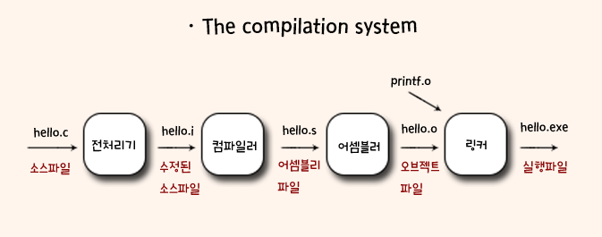

# chatper01
### 컴퓨터 시스템으로의 여행 (A Tour of Computer Systems)

- 컴파일 시스템 

  - 

  - 전처리 단계: 전처리기(cpp)는 본래의 C 프로그램을 #문자로 시작하는 디렉티브에 따라 수정한다. 예를 들어 hello.c 파일 첫 줄의 #include<stdio.h>는 전처리기에 시스템 헤더파일인 stdio.h를 프로그램 문장에 직접 삽입하라고 지시한다. (hello.i 생성)
  - 컴파일 단계 : 컴파일러(cci)는 텍스트파일 hello.i를 텍스트파일인 hello.s로 번역하며, 이 파일에는 어셈블러 프로그램이 저장된다. 
  - 어셈블리 단계: 어셈블러가 hello.s를 기계어 인스트럭션으로 번역하고 이들을 재배치가능 목적프로그램의 형태로 묶어서 hello.o라는 목적파일에 그 결과를 저장한다,.
  - 링크 단계: printf 함수는 이미 컴파일 된 별도의 목적파일인 printf.o에 들어 있으며, 이 파일은 hello.o파일과 링커 프로그램이 통합 작업을 수행한다. 그 결과로 실행가능 목적파일로 메모리에 적재되어 시스템에 의해 실행된다

